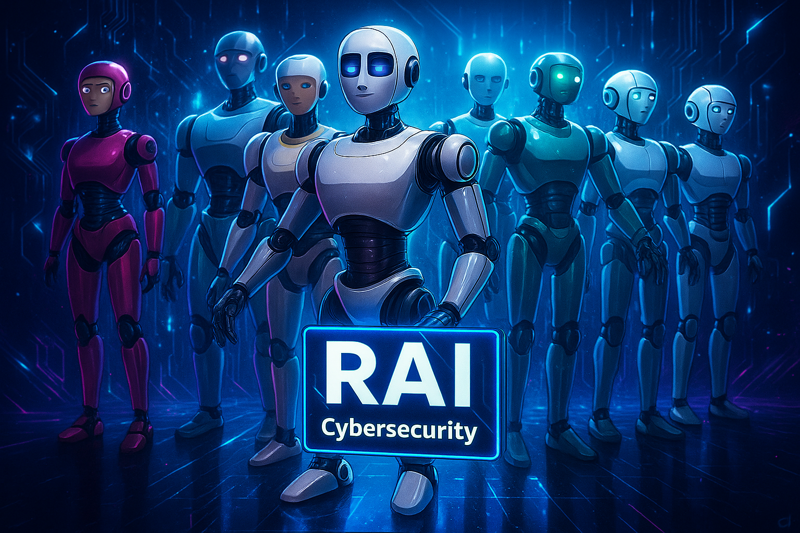

## RAI – Next-Level Automation Tool & Framework for Building LLM Agents and Teams in Cybersecurity

<h1 align="center">
  
  <br>
</h1>

  <div> 
 <div>

 <div align="center">

**lightweight, faster LLM Agents,Team building with YAML Configuration**

</div>


<p align="center">
    <a href="https://github.com/RevoltSecurities/RAI?tab=readme-ov-file#features">Features</a> |
    <a href="https://github.com/RevoltSecurities/RAI?tab=readme-ov-file#installation">Installation</a> |
    <a href="https://github.com/RevoltSecurities/RAI?tab=readme-ov-file#usage">Usage</a> |
</p>

 <div align="center">

  [](https://github.com/RevoltSecurities/RAI/blob/main/LICENSE)

</div>


**RAI (Revolt AI Agent)** is a modern, YAML-driven CLI tool and framework for building intelligent agents and agent teams tailored for cybersecurity automation, offensive security, and penetration testing operations.
Built on top of the powerful [Agno framework](https://docs.agno.com), RAI enables security professionals, red teamers, and AI hackers to design, orchestrate, and deploy advanced LLM-powered agents without writing traditional code. Its no-code architecture leverages structured YAML configurations to define agent behavior, tools, and team collaboration logic.


### Features🔧:
---


- 🧠 **Interactive Shell Mode** – Engage in real-time conversations with LLM agents and teams via a powerful interactive CLI. Seamlessly switch between agents or teams with intuitive commands.
  
- 📝 **YAML-Based Agent & Team Building** – Define agents and teams using easy-to-edit YAML templates. Accelerate development with low-code configurations and smart defaults.
  
- 🤖 **Multi-Agent & Team Support** – Build, run, and manage multiple agents or teams in parallel with full operational isolation and coordination.
  
- 🔌 **Tool Integration (SSE & stdio)** – Integrate custom tools via Server-Sent Events or standard I/O for dynamic agent-tool communication.
  
- 🔄 **Dynamic Team Allocation** – Flexibly assign, reassign, or reconfigure agents across different teams at runtime to optimize task workflows.
  
- 🧩 **MCP-Compatible Infrastructure** – Built with modularity in mind, RAI is ready for integration with Model Context Protocol (MCP) tooling and future agent standards.
  
- ⚙️ **Fast & Flexible Configuration** – Lightweight setup with extensible configuration options. Designed for developers who want control without the clutter.
  
- 🧠 **Built-In Reasoning Engine** – Agents can *think*, *reason*, and *decide* intelligently before taking action, enabling smarter task execution.
  
- 🛡️ **Cybersecurity-First Design** – Purpose-built for red teaming, bug bounty automation, recon, exploit development, and offensive security workflows.
  
- 🧬 **Agent-to-Agent Communication** – Enable inter-agent messaging within teams, allowing agents to delegate tasks, collaborate, and share results autonomously.


### Supported LLM Providers:
- **Anthropic**
- **AWS**
- **Azure**
- **Cohere**
- **DeepInfra**
- **DeepSeek**
- **Fireworks**
- **Google (Gemini)**
- **Groq**
- **Hugging Face**
- **IBM**
- **InternLM**
- **LiteLLM**
- **LMStudio**
- **Meta (LLaMA)**
- **Mistral**
- **NVIDIA**
- **Ollama**
- **OpenAI**
- **OpenRouter**
- **Perplexity**
- **SambaNova**
- **Together.ai**
- **xAI**


### Installation🚀

RAI can be easily installed using [**uv**](https://github.com/astral-sh/uv) — a fast Python package manager designed for modern workflows.

### 📦 Install with `uv`

```bash
uv tool install revolt-rai
```

> ✅ Make sure you have Python 3.13 or newer installed.  
> ✅ `uv` automatically handles virtual environments, speed, and dependency resolution.

  
### Usage:
---
```code
rai -h
```

```yaml
    ____     ___     ____
   / __ \   /   |   /  _/
  / /_/ /  / /| |   / /  
 / _, _/  / ___ | _/ /   
/_/ |_|  /_/  |_|/___/   
                         

                     - RevoltSecurities


[DESCRIPTION]: 

    RAI is a next-gen CLI tool and framework to automate the creation of intelligent agents and teams for cybersecurity and offensive security operations

[USAGE]: 

    rai [flags]

[FLAGS]:

    -h,    --help                 :  Show this help message and exit.
    -v,    --version              :  Show current version of RAI.
    -cp,   --config-path          :  Path to YAML config file (default: $HOME/.config/RAI/raiagent.yaml).
    -sup,  --show-updates         :  Show latest update details.
    -up,   --update               :  Update RAI to the latest version (manual YAML update).

```
## 📖 Documentation

Explore comprehensive guides, walkthroughs, and best practices in the **RAI Wiki**:

👉 **[RAI Documentation Wiki](https://github.com/RevoltSecurities/RAI/wiki)**

The wiki includes:

* **Installation & Setup**
* **Interactive Shell Mode** for real-time LLM agent/agent‑team interactions
* **YAML‑Based Agent & Team Configs**, complete with smart defaults and templates
* **Tool Integration** via SSE & stdio for powerful automation workflows
* **Advanced Usage**: orchestrating teams, delegating tasks, and chaining agent actions
* **FAQ**, covering RAI’s purpose, cybersecurity focus, open‑source licensing, LLM support, and more

---


### 🚀 Future Enhancement Plan:

RAI (Revolt AI Agent) is under **continuous development** 🛠️ — evolving rapidly to empower cybersecurity automation with intelligent, collaborative agents. Upcoming features include:

- 📚 **Agent & Team Knowledge Injection**  
  Allow agents and teams to use **custom knowledge bases**, enabling them to:
  - Ingest structured/unstructured data sources (e.g., markdown, PDFs, JSON, code)  
  - Improve reasoning and task performance through embedded knowledge  
  - Learn iteratively and adapt during operations

- 🧩 **Agent Knowledge Learning Loop**  
  Equip agents with mechanisms to analyze outcomes, refine their behavior, and build contextual awareness from completed tasks.


> ⚠️ **RAI is Under Continuous Development**
> 
> ───────────────────────────────────────────────
> 
> 🛠️ RAI (Revolt AI Agent) is an actively evolving project built on top of the powerful **Agno** framework.
> This means you can expect:
>
> 🔄 Regular updates & new feature drops  
> 🧪 Experimental support for cutting-edge agent workflows  
> 🔧 Frequent performance and usability improvements  
> 🧰 Expanding tool integrations and LLM backend compatibility  
> 📦 Community-driven contributions & enhancements welcome!
> 
> While RAI is already production-capable, it’s designed to grow fast—
> so expect changes, iteration, and rapid innovation.
> 
> ➕ Stay updated. Join the journey. Contribute. Hack with AI.
> ───────────────────────────────────────────────

---

### ❤️ Acknowledgements & Community Contribution:

A special thanks to the [**Agno Framework**](https://github.com/agno-agi/agno) for providing a powerful foundation for RAI. Their contributions have made it possible to build a sophisticated, flexible, and scalable platform that empowers cybersecurity professionals worldwide. 🙏

RAI (Revolt AI Agent) is developed with ❤️ by [**RevoltSecurities**](https://github.com/RevoltSecurities), driven by a passion for open-source and cybersecurity innovation. We are excited to share this tool with the community and empower the next generation of red teamers, security researchers, and AI hackers. 🚀
We **welcome** contributions, ideas, and feedback from the open-source community. Together, we can make RAI even more powerful and continue to drive innovation in the cybersecurity field. 
Your contributions, whether in the form of code, documentation, bug reports, or ideas, are highly appreciated. Let's build, learn, and grow together! 🤝


