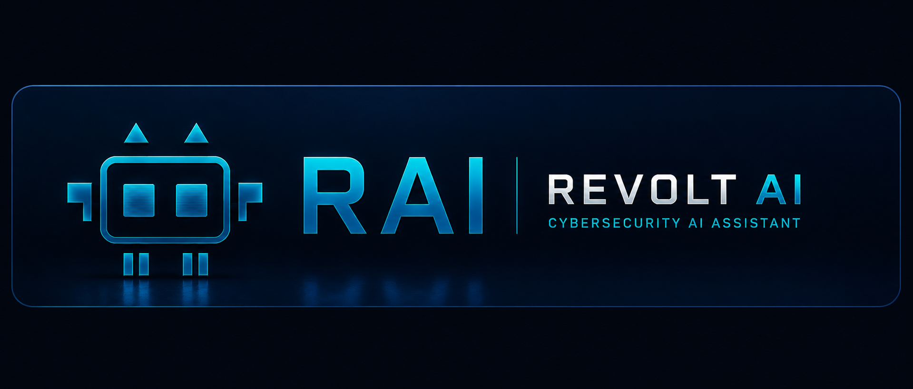

# RAI — Revolt AI

<div align="center">

 <p>
    <a align="center" href="" target="https://github.com/RevoltSecurities/RAI">
      
    </a>
  </p>


**The open-source AI security operator built for professionals.**

RAI works, builds, hacks, and assists — autonomously.  
It thinks like a security researcher, codes like an engineer,  
and operates like a professional red teamer. All in your terminal.

[](https://pypi.org/project/revolt-rai/)
[](https://www.python.org/)
[](https://github.com/RevoltSecurities/revolt-rai/releases)
[](https://github.com/RevoltSecurities/revolt-rai/commits/main)
[](LICENSE)
[](https://github.com/RevoltSecurities/revolt-rai/pkgs/container/revolt-rai)

</div>

---

## What is RAI?

RAI is a terminal-native AI security assistant and autonomous agent that executes across the full cybersecurity spectrum — from initial recon to exploit development, SAST, threat modeling, bug bounty, VAPT, and SOC operations.

It is not a chatbot. It is an operator.

RAI orchestrates a team of specialized subagents in parallel, maintains memory across sessions, learns from every engagement, writes and executes structured plans with your approval, and builds its own tools when none exist. It reads code, writes exploits, probes APIs, maps attack surfaces, triages vulnerabilities, and documents findings — all autonomously, all in your terminal.

Whether you are a solo bug bounty hunter, a professional red teamer, or a security engineer automating your workflow — RAI adapts to how you work.

---

## What RAI Can Do

### Security Operations
- Map full attack surfaces — web, API, cloud, Kubernetes, Docker, Android, network
- Probe endpoints for OWASP Top 10, authentication bypass, IDOR, SSRF, injection, and more
- Research CVEs, pull exploit PoCs, cross-reference HackerOne prior art
- Generate Nuclei templates, IDOR enumerators, and custom fuzz scripts
- Write comprehensive pentest reports with findings, severity, and reproduction steps

### Secure Code Analysis
- Run static analysis with semgrep, bandit, gosec, and custom rules
- Detect secrets, hardcoded credentials, and insecure configurations
- Audit dependency trees for known CVEs
- Trace data flows from source to sink across entire codebases
- Suggest and implement remediation in-place

### Security Tooling & Automation
- Write exploit scripts and PoC builders from scratch
- Build custom security tools, scanners, and automation pipelines
- Create specialized AI subagents tailored to your workflow
- Extend itself with skills you define in plain Markdown
- Integrate with any external tool via MCP (Burp Suite, Nuclei, custom APIs)

### Engineering Assistance
- Architect security-aware systems and review designs for flaws
- Generate test suites, CI security gates, and hardening scripts
- Explain vulnerability classes, attack chains, and mitigations in depth
- Pair-program exploit development with full context awareness

---

## Unique Features

### Plan Mode — Structured Autonomous Execution

RAI doesn't just run — it plans. Before executing a complex engagement, RAI writes a structured multi-step plan with a title, description, and execution approach for every step. The plan is presented for your review and approval before a single action is taken.

```
Here RAI plan is ready:

About the Plan: Web application penetration test for api.example.com

1. Enumerate API Endpoints  ⬜
   * Map all exposed routes using OpenAPI spec and live probing.
   * 🔧 Load spec, verify with GET requests, use gobuster for undocumented routes.

2. Test Authentication  ⬜
   * Verify each endpoint enforces proper authentication.
   * 🔧 Create auth profiles (admin/user/unauth), compare responses for 401/403 vs 200.

3. Test for IDOR  ⬜
   * Probe object references across all user-scoped endpoints.
   * 🔧 Enumerate IDs, swap user tokens, record access control differences.
```

You can approve, reject, edit the plan, or send guidance — RAI adapts and continues. Every step is tracked live in the TUI. Blocked steps are flagged with reasons. Completed steps accumulate notes for the final report.

**Why this matters:** You always know what RAI is about to do. No black-box execution. No surprises.

---

### Self-Learning Memory Loop

RAI gets smarter with every engagement. When a plan completes, RAI automatically enters a self-learning phase — it reviews what happened, extracts key facts, methodology notes, blockers, and lessons learned, and writes them into its persistent memory.

On the next engagement, those memories are loaded into context. RAI remembers:

- **Target facts** — what was tested, what was found, what the architecture looks like
- **Methodology** — what worked, what didn't, which tools were effective
- **Blockers and workarounds** — WAF rules, rate limits, auth edge cases you discovered
- **Lessons learned** — patterns that generalize to future targets

This is not just conversation history. It is structured, agent-scoped memory that persists across sessions, across targets, and across time. RAI becomes more capable with every engagement you run.

---

### Persistent Agent Memory

Every agent in RAI maintains its own memory store at `~/.rai/agents/<name>/memory/`. Memory is written at the end of each run, organized by scope:

- **Agent-scope** — methodology, preferred tools, approach patterns
- **User-scope** — your preferences, how you like to work, engagement conventions
- **Project-scope** — target-specific facts loaded when relevant

Memory is plain Markdown — human-readable, editable, and version-controllable. You can read, edit, or delete any memory entry directly. RAI does not hide its internal state.

---

### User Preferences

RAI adapts to how you work. Tell it once — it remembers forever:

- *"Always include PoC code in findings"* — RAI will include PoC in every finding
- *"I prefer nuclei over manual probing for known CVEs"* — RAI routes to nuclei first
- *"Write reports in a formal pentest style"* — all output matches that style
- *"Skip recon when I provide a target scope file"* — RAI skips and goes straight to testing

Preferences are stored as agent memories and loaded on every run. You never repeat yourself.

---

### Human-in-the-Loop Tool Approval

Every tool call RAI makes can be reviewed before execution. In interactive mode, a beautiful approval panel shows you exactly what is about to run — the tool name, the arguments, the target — and asks you to approve, edit, or reject it.

Dangerous operations (file writes, shell commands, network requests) surface clearly. You stay in control at every step while RAI handles the complexity.

---

### Background Runs

RAI can run multiple engagements simultaneously. Launch a task, send it to the background with `ctrl+b`, start another, and monitor all of them from the background runs panel. Each run has its own thread, its own memory, and its own execution context.

---

### Context Compaction — Infinite Conversations

Long engagements accumulate thousands of tokens. RAI automatically compacts conversation history when it approaches model limits — summarizing completed work, retaining recent context, and continuing seamlessly. You never hit a wall mid-engagement.

Use `/compact` manually at any time, or let auto-compaction handle it silently.

---

### RTK — Built-in Token Efficiency

RAI ships with native [RTK (Rust Token Killer)](https://github.com/reachingforthejack/rtk) integration. RTK rewrites verbose shell commands into token-efficient equivalents before they are executed — reducing token consumption on every bash tool call by 60–90%.

Unlike the Claude Code hook approach (which can only block, not rewrite), RAI implements RTK as a native middleware that mutates the command before execution. The rewrite is transparent — you see the original intent, RAI runs the efficient version.

RTK is **optional** — RAI falls back silently if it is not installed. To enable it:

```bash
# Install RTK
cargo install rtk
# or via homebrew (if available)
brew install rtk

# Disable per-session if needed
rai --no-rtk
```

When installed, every bash command RAI runs is automatically rewritten. `git status` → `rtk git status`. `cat file` → `rtk cat file`. Thousands of tokens saved per engagement.

---

### Security Findings Panel

As RAI works through an engagement, it surfaces findings in a dedicated panel accessible via `/findings`. Vulnerabilities, misconfigurations, and security issues are collected and displayed with severity, description, and reproduction steps — building a structured report as the engagement progresses rather than dumping everything at the end.

---

### MCP — Connect Any Tool

RAI speaks Model Context Protocol. Connect Burp Suite, custom vulnerability databases, internal APIs, or any MCP-compatible tool to any agent in seconds:

```bash
rai mcp add burp npx @burpsuite/mcp-server --agent recon
rai mcp add nuclei-server https://nuclei-mcp.internal --transport sse
rai mcp add custom-db https://vulndb.company.com --transport http \
  --header "Authorization:Bearer token"
```

Every connected tool becomes part of the agent's capability set — available to use in plans, in autonomous runs, and in interactive sessions.

---

### Multi-Agent Architecture

RAI does not run alone. It coordinates a team:

| Agent | Specialization |
|-------|---------------|
| `recon` | Full attack surface mapping — web, API, cloud, K8s, Docker, Android, network |
| `researcher` | CVE research, exploit PoC hunting, H1 prior art, threat intel |
| `coder` | Exploit scripts, PoC builders, Nuclei templates, IDOR enumerators, automation |
| `sast-analyzer` | Static analysis — semgrep, bandit, gosec, secret scanning, dependency audit |
| `agent-creator` | Interactively designs, prompts, and registers new specialized subagents on demand |

Each subagent has its own system prompt, memory, MCP configuration, and optionally a different model. The main RAI agent dispatches tasks, synthesizes results, and maintains the high-level strategy.

---

### Custom Subagents — Build Your Own AI Security Team

RAI's `agent-creator` subagent lets you design and deploy new specialized subagents interactively — no code required. Describe what you need, and RAI scaffolds a fully configured subagent with a tailored system prompt, tool access, and memory.

```bash
# In the TUI, run:
/create-agent
# A guided wizard walks you through naming, describing, and configuring the agent.
# RAI's agent-creator writes the system prompt, registers the agent, and it's ready.
```

Or scaffold one manually:

```bash
rai agents config-init mobile-tester
# Edit ~/.rai/agents/mobile-tester/AGENTS.md — write your system prompt
rai agents config-set mobile-tester --model claude-sonnet-4-5

# Now use it
rai --agent mobile-tester
```

Every custom subagent gets its own:
- **System prompt** — fully customizable in `AGENTS.md`
- **Memory store** — learns from every session independently
- **MCP config** — connect different tools per agent
- **Model override** — run expensive tasks on powerful models, quick tasks on fast ones

Build a team tailored to your exact engagement workflow — a mobile tester, a cloud auditor, a blockchain security agent, a compliance reviewer — each one purpose-built and persistent.

---

### Skills — Extend Without Code

Skills are plain Markdown files that inject custom instructions, context, and tool access into any agent. Write a skill once, activate it in any session:

```bash
rai skills create mobile-recon        # scaffold a new skill
# Edit ~/.rai/skills/mobile-recon/SKILL.md — describe what the skill does
# Use it: /skill:mobile-recon
```

Install community skill packs from git in one command:

```bash
rai skills add https://github.com/RevoltSecurities/rai-skills
```

---

### 4 Beautiful Themes

RAI looks as sharp as it performs. Switch themes with `ctrl+t`:

| Theme | Description |
|-------|-------------|
| `rai` | Tokyo Night — deep dark with electric blue accents |
| `github-dark` | GitHub's iconic dark palette |
| `glass` | Glassmorphism deep navy |
| `claude` | Claude Code burnt orange on warm dark |

---

## Installation

### Recommended — uv

```bash
curl -LsSf https://astral.sh/uv/install.sh | sh
uv tool install revolt-rai
```

### pip / pipx

```bash
pip install revolt-rai
pipx install revolt-rai
```

`rai chat` and the HTTP server are included in the default install.

### With extra providers

```bash
uv tool install "revolt-rai[bedrock]"        # AWS Bedrock
uv tool install "revolt-rai[groq]"           # Groq
uv tool install "revolt-rai[openrouter]"     # OpenRouter
uv tool install "revolt-rai[all-providers]"  # everything
```

### From source

```bash
git clone https://github.com/RevoltSecurities/RAI
cd RAI
uv tool install .
```

---

## First-Time Setup

One command to configure your model and API key:

```bash
# Anthropic Claude (recommended)
rai agents config-set rai --model claude-sonnet-4-5 --api-key sk-ant-...

# OpenAI
rai agents config-set rai --model gpt-4o --api-key sk-...

# Google Gemini
rai agents config-set rai --model gemini/gemini-2.0-flash --api-key AIza...

# Ollama (local, no key needed)
rai agents config-set rai --model ollama/qwen2.5:latest

# AWS Bedrock
rai agents config-set rai --model bedrock/us.anthropic.claude-sonnet-4-5-20251001-v1:0
```

Then launch:

```bash
rai
```

Subagents inherit the main agent's model and key automatically. Override individually only when needed:

```bash
rai agents config-set coder --model gpt-4o --api-key sk-...
```

Or skip config entirely and use environment variables:

```bash
ANTHROPIC_API_KEY=sk-ant-... RAI_MODEL=claude-sonnet-4-5 rai
```

---

## Usage

### Interactive TUI

```bash
rai
rai --model claude-sonnet-4-5
rai --agent my-agent
rai --target https://example.com
rai chat --remote-url https://rai.example.com --server-key sk-...
```

Use `--remote-url` when you want to attach the TUI to an already running RAI HTTP server instead of starting a local one.

### Headless — single task

```bash
rai run "scan example.com for open ports and web technologies"
rai run "review this Go codebase for vulnerabilities" --model gpt-4o
rai run "enumerate all API endpoints and test for IDOR"
```

### Resume a conversation

```bash
rai chat --continue              # resume most recent thread
rai chat --resume <thread-id>    # resume a specific thread
```

---

## TUI Keyboard Shortcuts

| Key | Action |
|-----|--------|
| `ctrl+t` | Cycle themes |
| `ctrl+b` | Background runs panel |
| `ctrl+p` | Plan panel |
| `ctrl+n` | New thread |
| `ctrl+c` / `ESC` | Cancel active run |

### Slash Commands

| Command | Description |
|---------|-------------|
| `/new` | Start a new thread |
| `/threads` | Browse conversation history |
| `/runs` | Browse active and past runs |
| `/agents` | List available agents |
| `/model [name]` | Show or switch model for next run |
| `/theme` | Cycle themes |
| `/compact` | Compact conversation context |
| `/compact status` | Show context usage and token count |
| `/mcp` | View connected MCP servers |
| `/skills` | List available skills |
| `/skill:<name>` | Activate a specific skill |
| `/bg` | Background runs panel |
| `/findings` | Show security findings panel |
| `/tokens` | Show token usage |
| `/auto` | Toggle auto-approve for tool calls |
| `/editor` | Open prompt in `$EDITOR` (`Ctrl+X`) |
| `/clear` | Clear messages |
| `/debug` | Show live TUI state |
| `/create-agent` | Launch guided wizard to create a new subagent |
| `/changelog` | Open changelog in browser |
| `/issue` | Open GitHub issues in browser |
| `/quit` | Quit RAI |
| `/help` | Show all commands |

---

## CLI Reference

### `rai agents`

```bash
rai agents list
rai agents show <name>
rai agents config <name>
rai agents config-set <name> [--model] [--api-key] [--base-url] [--temperature]
rai agents config-init <name>
rai agents reset <name>
rai agents memory-clear <name>
```

### `rai threads`

```bash
rai threads list [--agent rai] [--limit 50]
rai threads delete <thread-id>
```

### `rai config`

```bash
rai config show
rai config init
```

### `rai mcp`

```bash
rai mcp add <name> <command-or-url> [--transport stdio|sse|http] [--agent name]
rai mcp remove <name>
rai mcp list
```

### `rai skills`

```bash
rai skills list
rai skills create <name>
rai skills add <git-url-or-path>
rai skills info <name>
rai skills delete <name>
```

---

## Environment Variables

### Core

| Variable | Description |
|----------|-------------|
| `RAI_MODEL` | Default model (e.g. `claude-sonnet-4-5`, `gpt-4o`) |
| `RAI_RATE_LIMIT_PROFILE` | Rate limit: `normal` · `slow` · `fast` |
| `RAI_SHELL_ALLOW_LIST` | Comma-separated shell commands the agent may run |
| `RAI_DISABLE_PROMPT_CACHE` | Set `1` to disable Anthropic prompt caching |
| `RAI_LITELLM_PROXY_PREFIX` | LiteLLM proxy model prefix (default: `openai`) |

### Context Compaction

| Variable | Default | Description |
|----------|---------|-------------|
| `RAI_COMPACT_MSG_TRIGGER` | `40` | Compact after N messages |
| `RAI_COMPACT_TOKEN_TRIGGER` | `100000` | Compact after N tokens |
| `RAI_COMPACT_KEEP` | `20` | Messages to keep after compaction |
| `RAI_COMPACT_TRUNCATE_AT` | `30` | Truncate tool args at N chars |
| `RAI_COMPACT_TRUNCATE_MAX` | `2000` | Max chars for truncated content |

### HTTP Server

| Variable | Description |
|----------|-------------|
| `RAI_SERVE_MODEL` | Model for the server agent |
| `RAI_SERVE_AGENT` | Agent name (default: `rai`) |
| `RAI_SERVE_API_KEY` | API key |
| `RAI_SERVE_BASE_URL` | Custom base URL |
| `RAI_SERVE_TARGET` | Default engagement target |
| `RAI_SERVE_HITL` | Set `1` for human-in-the-loop tool approval |
| `RAI_SERVE_NO_MCP` | Set `1` to disable MCP tools |
| `RAI_SERVE_DISABLE_SUBAGENTS` | Set `1` to disable subagents |
| `RAI_SERVE_ENABLE_MEMORY` | Set `0` to disable memory (default: `1`) |
| `RAI_SERVE_ENABLE_SHELL` | Set `0` to disable shell tools (default: `1`) |
| `RAI_SERVE_ENABLE_AUDIT` | Set `0` to disable audit log (default: `1`) |
| `RAI_SERVE_SYSTEM_PROMPT` | Override system prompt |
| `RAI_SERVE_SYSTEM_PROMPT_EXTRA` | Append extra content to system prompt |

### Debug

| Variable | Description |
|----------|-------------|
| `DEV` | Set `1` for verbose startup logs |
| `RAI_DEBUG_LOG_CALLS` | Set `1` to log all LLM calls to file |

### Provider API Keys

```bash
ANTHROPIC_API_KEY=sk-ant-...
OPENAI_API_KEY=sk-...
GOOGLE_API_KEY=AIza...
GROQ_API_KEY=gsk_...
AWS_ACCESS_KEY_ID=...
AWS_SECRET_ACCESS_KEY=...
AWS_DEFAULT_REGION=us-east-1
```

---

## HTTP Server & SDK

Deploy RAI as a server for custom integrations and web UIs:

```bash
RAI_SERVE_MODEL=claude-sonnet-4-5 \
RAI_SERVE_API_KEY=sk-ant-... \
rai serve --host 0.0.0.0 --port 8000
```

Build your own AI security agents with the Python SDK:

```python
from rai.sdk import RaiAgent

agent = (
    RaiAgent("webapp-tester")
    .model("claude-sonnet-4-5")
    .api_key("sk-ant-...")
    .system_prompt("You are a specialized web application security tester.")
    .build()
)

agent.serve()
```

---

## Configuration Files

| Path | Purpose |
|------|---------|
| `~/.rai/agents/<name>/config.toml` | Per-agent model, api_key, base_url, temperature |
| `~/.rai/agents/<name>/AGENTS.md` | Agent system prompt and metadata |
| `~/.rai/agents/<name>/mcp.json` | Agent-specific MCP servers |
| `~/.rai/agents/<name>/memory/` | Agent memory store |
| `~/.rai/.mcp.json` | Global MCP servers (all agents) |
| `~/.rai/skills/` | User skills directory |
| `~/.rai/plans/` | Saved plan files |
| `~/.rai/sessions.db` | Thread and checkpoint storage |
| `~/.rai/audit.log` | Audit log of all tool executions |

---

## Requirements

- Python 3.11+
- An API key for any supported provider

---

## Links

- [GitHub](https://github.com/RevoltSecurities/RAI)
- [PyPI](https://pypi.org/project/revolt-rai/)
- [Issues](https://github.com/RevoltSecurities/RAI/issues)

---

<div align="center">

Built with ❤️ by [RevoltSecurities](https://github.com/RevoltSecurities)

</div>
